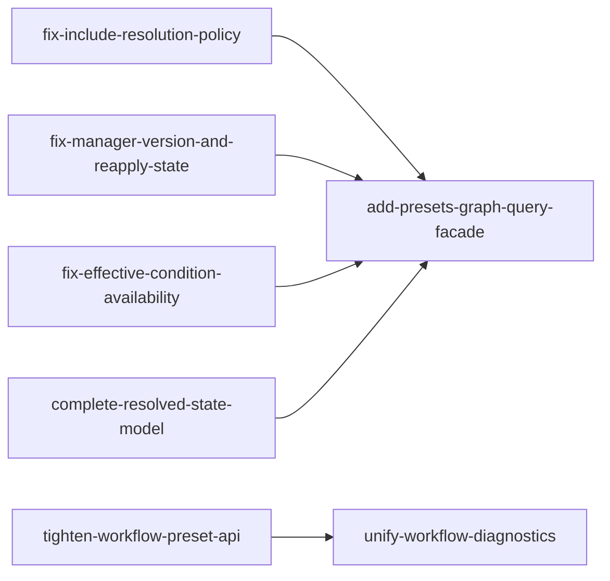

# Preset Graph Library Architecture Review

## Scope

This major feature covers architecture corrections for the `NhcPresetGraph`
library identified in `260504-architecture-review.md`.

The work is limited to aligning include resolution, inheritance availability,
resolved preset state, workflow diagnostics, and graph-manager query ergonomics
with the current OpenSpec specs and the CMake 4.3.2 `cmake-presets(7)` manual.
It should be split into independent OpenSpec changes rather than implemented as
one large change.

Do not create OpenSpec change artifacts for this major feature until explicitly
confirmed.

## Architecture Decision: Host-Derived Include Macros

Review Next Step 6 recommended auto-populating `${hostSystemName}` and deriving
`${pathListSep}` in the graph manager.

Decision: reject that recommendation for this major feature.

Rationale: the current `preset-macro-context` spec states that macro values are
caller-controlled and that the system SHALL NOT read from the host system to
implicitly populate macros like `${sourceDir}` or `${hostSystemName}`. The
library may inject macros derived from known file or preset state, such as
`${fileDir}` and `${presetName}`, but host-derived macro values remain caller
input unless a future spec change intentionally revisits that contract.

Implication: there is no standalone OpenSpec change for host-derived macro
auto-population. The review item is recorded here as an evaluated and rejected
recommendation.

## Current Change List

### 1. fix-include-resolution-policy

Status: Pending

Purpose:
- Fix include macro-policy enforcement at the manager integration boundary.

Primary review issue:
- Issue 1: `PresetIncludeGraph::ResolveIncludes()` is dead code at manager
  level, so unsupported include macros are not reported correctly.

Expected direction:
- Keep include macro policy in the include graph layer.
- Keep discovered-file loading in the manager.
- Avoid duplicating macro-policy logic in `PresetsGraph::ApplyContext()`.

Depends On:
- None

### 2. fix-effective-condition-availability

Status: Pending

Purpose:
- Fix inherited condition availability evaluation.

Primary review issues:
- Issue 2: condition inheritance is not reflected in inheritance graph payloads.
- Issue 4: `PresetModel::ResolveCondition()` has no cycle guard.

Expected direction:
- Add a cycle guard before using `ResolveCondition()` during graph refresh.
- Populate inheritance payloads with the effective inherited condition.

Depends On:
- None

### 3. fix-manager-version-and-reapply-state

Status: Pending

Purpose:
- Fix manager-level CMake version mapping and repeated context application.

Primary review issues:
- Issue 3: CMake 4.0, 4.1, and 4.2 incorrectly support preset file version 11.
- Issue 5: include graph unresolved state can remain stale between
  `ApplyContext()` calls.

Expected direction:
- Map preset file version 11 to CMake 4.3+ only.
- Clear file-node unresolved state before a reload attempt.

Depends On:
- None

### 4. tighten-workflow-preset-api

Status: Pending

Purpose:
- Complete workflow preset typed API hiding.

Primary review issue:
- Issue 6: `WorkflowPreset` still exposes inherited condition-state helpers.

Expected direction:
- Hide the remaining unsupported typed accessors inherited from `Preset`.

Depends On:
- None

### 5. complete-resolved-state-model

Status: Pending

Purpose:
- Bring resolved-state behavior into alignment with the `preset-model` spec.

Primary review issues:
- Issue 7: public `ResolvedPreset` diverges from spec guidance.
- Issue 8: environment values are not expanded in `RefreshResolvedState()`.
- Issue 9: scalar preset field coverage is narrow.

Expected direction:
- Expand environment values into preset-owned resolved state.
- Preserve per-field resolution status.
- Migrate callers away from public `ResolvedPreset` once replacement state is
  complete enough.
- Extend scalar field expansion coverage incrementally.

Depends On:
- None

### 6. add-presets-graph-query-facade

Status: Pending

Purpose:
- Add a lightweight query facade after the underlying graph and model behavior
  is stable.

Primary review issue:
- Next Step 10: common consumers need a simpler entry point than directly
  coordinating include graph, inheritance graph, and preset model access.

Expected direction:
- Build on the corrected include, inheritance, and resolved-state behavior.
- Keep the facade thin; it should not become a second resolution engine.

Depends On:
- 1. fix-include-resolution-policy
- 2. fix-effective-condition-availability
- 3. fix-manager-version-and-reapply-state
- 5. complete-resolved-state-model

### 7. unify-workflow-diagnostics

Status: Pending

Purpose:
- Decide and implement how workflow validation diagnostics should be surfaced.

Primary review issue:
- Next Step 11: workflow validation diagnostics are separate from preset
  unresolved state.

Expected direction:
- Decide whether workflow diagnostics remain manager-level only or also mark
  the workflow preset unresolved.
- Keep workflow presets out of inheritance resolution either way.

Depends On:
- 4. tighten-workflow-preset-api

## Dependency Diagram

Nodes with the blue marker have OpenSpec artifacts created.
