# Unified Preset Graph

## Scope

Re-architect the `NhcPresetGraph` library around a single read-only graph
produced by an explicit rebuild step. The current library exposes three
loosely coordinated sub-objects (`IncludeGraph`, `InheritanceGraph`,
`PresetModel`) and a `PresetsGraph` shell that drives them. This major
feature replaces that shape with:

- One typed graph (`Graph`) holding all nodes and edges.
- A `Manager` that owns caller-mutable input state (`MacroContext`, root
  files, host info) and rebuilds the graph wholesale on an explicit call.
- Six node kinds (`FileNode`, `ConfigureNode`, `BuildNode`, `TestNode`,
  `PackageNode`, `WorkflowNode`) and five edge kinds (`Defines`,
  `Includes`, `Inherits`, `Configures`, `WorkflowStep`).
- Per-node and per-edge diagnostics, typed placeholder nodes for
  unresolved references, and cycle preservation with diagnostic
  annotations rather than edge deletion.

The full design is captured in
[`260520-architecture-design.md`](260520-architecture-design.md). This
README tracks scope, decisions, the change list, and the dependency
diagram.

Do not create OpenSpec change artifacts for this major feature until
explicitly confirmed.

## Relationship to `preset-graph-lib-arch-review`

The existing
[`preset-graph-lib-arch-review`](../preset-graph-lib-arch-review/README.md)
plan covers incremental architecture corrections against the current
library shape (include macro policy, inherited condition availability,
version mapping, workflow API hiding, resolved-state alignment, query
facade, workflow diagnostics).

This major feature redesigns the underlying shape rather than patching
it. The relationship between the two plans is an **open decision**
recorded below; this plan does not assume it supersedes the review work.

## Decisions

The decisions below were converged during the design session that
produced [`260520-architecture-design.md`](260520-architecture-design.md).

1. **Single read-only `Graph`, explicit `Manager::rebuild()`.** Callers
   never mutate the graph. They mutate input state on the `Manager` and
   trigger `rebuild()` to swap in a fresh `Graph`. `NodeId` values are
   not stable across rebuilds; callers re-look-up by `(kind, name)`.
2. **Six node kinds, five edge kinds.** No `MacroNode`, no `ContextNode`.
   Macros are not graph entities. Cross-preset relationships exist only
   where the CMake presets spec defines them: `inherits`, `configurePreset`,
   workflow `steps`.
3. **`MacroContext` is a flat caller-owned map.** Holds only the
   external process environment used by `$penv{}` and as the fallback
   for `$env{}`. It is not a node and has no edges.
4. **`environment` is a dedicated member on `PresetNode`.** Separate
   from the generic `fields` map. Inherits by key-merge with
   `null`-means-unset semantics. Resolved on-demand with per-key cycle
   detection. `$env{}` resolves against the merged preset environment
   first, then falls through to `MacroContext`.
5. **Typed placeholders, never null.** Any unresolved reference yields
   a placeholder of the expected derived kind with `isResolved() == false`
   and at least one `Error` diagnostic.
6. **Per-node and per-edge diagnostics.** Both nodes and edges own
   their own `std::vector<Diagnostic>`. No central diagnostics store on
   `Graph` (a `Graph::diagnostics()` convenience view may iterate over
   all of them).
7. **Cycles are preserved as edges with annotations.** Include cycles
   and inheritance cycles are detected and assigned a stable `cycleId`
   per rebuild. Each participating edge gains one `Diagnostic` per
   cycle it participates in; the edge set is not modified. Downstream
   traversal decides whether to follow a flagged edge.
8. **Workflow steps are never elided.** `WorkflowStep` edges are
   emitted for every declared step in order; missing targets resolve
   to typed placeholders. Callers rely on `isResolved()` per step.
9. **`consumedKeys` is YAGNI for now.** No tracking of which macro
   keys each field consumed; add later if "find all uses of macro X"
   becomes a real query. The hook is `FieldEntry`/`EnvEntry`; future
   addition is purely additive.
10. **Built-in macros remain caller-controlled.** Consistent with the
    `preset-macro-context` decision recorded in the existing arch
    review plan: the library does not read the host system to populate
    `${hostSystemName}` etc. without explicit caller input. Host info
    on the `Manager` is caller-supplied.

## Constraints

- Must conform to the CMake 4.3.2 `cmake-presets(7)` macro set:
  `${sourceDir}`, `${sourceParentDir}`, `${sourceDirName}`,
  `${presetName}`, `${fileDir}`, `${hostSystemName}`, `${pathListSep}`,
  `${generator}` (limited contexts), `$env{...}`, `$penv{...}`,
  `$vendor{...}`. No invented syntax.
- `${presetName}` resolves to the **using** preset's name, not the
  defining one. Inherited fields are resolved in the descendant's
  context.
- Macro values inside preset `environment` entries may themselves
  contain macros; resolution is on-demand with cycle detection within
  the map.
- `$vendor{...}` passes through verbatim and is not flagged as an
  unresolved reference.
- Code style, testing, and OpenSpec workflow requirements in
  [`AGENTS.md`](../../../AGENTS.md) apply to every change in this
  feature.

## Open Decisions

These are deliberately deferred until the first change is scoped:

- **Relationship to `preset-graph-lib-arch-review`.** Should the review
  plan land first (stabilising the current library), run in parallel,
  or be superseded outright by this redesign? Affects sequencing and
  whether the review's `add-presets-graph-query-facade` is still
  needed.
- **Diagnostic addressing detail.** Per-node diagnostics could live in
  the `Node` base or be a side map keyed by `NodeId`. Per-edge
  diagnostics could live on `Edge` directly or in a side map keyed by
  edge index. The chosen storage is per-node and per-edge ownership
  (decision 6); the exact field layout is left to implementation.
- **`MacroContext` mutation surface.** Whether to expose mutation as a
  whole-map assign, key-level `Add`/`Remove`/`Clear`, or both.
- **`SourceLocation` representation.** File `NodeId` plus a JSON
  pointer string, plus optionally line/column for caller display.
- **Migration path.** Whether existing consumers migrate
  incrementally behind a compatibility shim or via a single
  cutover.

## Current Change List

Each entry is a candidate OpenSpec change. Granularity may shrink (some
of these may merge in practice). All entries are tentative until the
relationship-to-arch-review decision is made.

### 1. introduce-graph-and-node-taxonomy

Status: Planned

Purpose:
- Introduce `Graph`, `NodeId`, the `Node` base, and the six derived
  node kinds (`FileNode`, `ConfigureNode`, `BuildNode`, `TestNode`,
  `PackageNode`, `WorkflowNode`). No edges, no manager yet.

Depends On:
- None

### 2. introduce-edge-taxonomy-and-diagnostics

Status: Planned

Purpose:
- Introduce `Edge` with the five edge kinds and per-edge diagnostics.
  Add the `Diagnostic` struct (with `cycleId`) and per-node diagnostic
  storage.

Depends On:
- 1. introduce-graph-and-node-taxonomy

### 3. introduce-manager-and-macrocontext

Status: Planned

Purpose:
- Introduce `Manager` with `MacroContext`, root file list, host info,
  and the read-only `graph()` accessor. Implement an empty `rebuild()`
  that produces an empty `Graph`.

Depends On:
- 1. introduce-graph-and-node-taxonomy

### 4. implement-parse-phase

Status: Planned

Purpose:
- Walk root files and their `include` trees. Emit `FileNode`s, raw
  `PresetNode`s and `WorkflowNode`s, `Defines` and `Includes` edges.
  Detect duplicate names. Detect include cycles and annotate
  participating `Includes` edges with `IncludeCycle` diagnostics
  using stable per-rebuild `cycleId`s.

Depends On:
- 2. introduce-edge-taxonomy-and-diagnostics
- 3. introduce-manager-and-macrocontext

### 5. implement-inheritance-merge

Status: Planned

Purpose:
- Walk `Inherits` edges in declared order. Merge fields into the
  descendant's map with provenance pointing to the source ancestor.
  Apply key-merge semantics to the dedicated `environment` map, with
  `null`-means-unset. Detect inheritance cycles and annotate
  participating `Inherits` edges with `InheritanceCycle` diagnostics.

Depends On:
- 4. implement-parse-phase

### 6. implement-macro-resolution

Status: Planned

Purpose:
- Resolve each preset's `environment` map on-demand with per-key cycle
  detection (phase 3a). Then resolve other fields using `$env{}`/
  `$penv{}` rules against the resolved environment and `MacroContext`
  (phase 3b). Pass `$vendor{...}` through verbatim. Emit diagnostics
  for unresolved references and intra-environment cycles.

Depends On:
- 5. implement-inheritance-merge

### 7. implement-condition-evaluation

Status: Planned

Purpose:
- Evaluate each preset's `condition` field over its resolved fields.
  Store `conditionPassed` on the `PresetNode`. Honour CMake's
  null-condition non-propagation semantics already implemented in
  `PresetModel::ResolveCondition()`.

Depends On:
- 6. implement-macro-resolution

### 8. implement-workflow-wiring-and-placeholders

Status: Planned

Purpose:
- Emit `WorkflowStep` edges for every declared workflow step in
  order. Materialise typed placeholder nodes of the expected derived
  kind for missing targets, with `isResolved() == false` and an
  `Error` diagnostic.

Depends On:
- 4. implement-parse-phase

### 9. implement-validation-phase

Status: Planned

Purpose:
- Kind-specific invariants: configure preset must declare a generator
  (where required by spec), build/test/package presets must reference
  a configure preset, workflow step targets must be the expected kind,
  etc. Emit `Error`/`Warning` diagnostics on the appropriate node or
  edge. Mark affected nodes unresolved when invariants are violated.

Depends On:
- 7. implement-condition-evaluation
- 8. implement-workflow-wiring-and-placeholders

### 10. migrate-callers-and-retire-legacy-library

Status: Planned

Purpose:
- Migrate existing consumers (UI surfaces, tools, tests) from the
  current `PresetsGraph` / `IncludeGraph` / `InheritanceGraph` /
  `PresetModel` API to the new `Manager` / `Graph` API. Remove the
  legacy types once nothing references them. Sequencing depends on
  the open decision about the relationship to
  `preset-graph-lib-arch-review`.

Depends On:
- 9. implement-validation-phase

## Dependency Diagram

```mermaid
flowchart LR
  NodeTaxonomy[1. introduce-graph-and-node-taxonomy]
  EdgeDiagnostics[2. introduce-edge-taxonomy-and-diagnostics]
  ManagerCtx[3. introduce-manager-and-macrocontext]
  ParsePhase[4. implement-parse-phase]
  InheritanceMerge[5. implement-inheritance-merge]
  MacroResolution[6. implement-macro-resolution]
  ConditionEval[7. implement-condition-evaluation]
  WorkflowWiring[8. implement-workflow-wiring-and-placeholders]
  Validation[9. implement-validation-phase]
  Migration[10. migrate-callers-and-retire-legacy-library]

  NodeTaxonomy --> EdgeDiagnostics
  NodeTaxonomy --> ManagerCtx
  EdgeDiagnostics --> ParsePhase
  ManagerCtx --> ParsePhase
  ParsePhase --> InheritanceMerge
  ParsePhase --> WorkflowWiring
  InheritanceMerge --> MacroResolution
  MacroResolution --> ConditionEval
  ConditionEval --> Validation
  WorkflowWiring --> Validation
  Validation --> Migration

  classDef planned fill:#475569,stroke:#cbd5f5,stroke-width:1px,color:#ffffff
  class NodeTaxonomy,EdgeDiagnostics,ManagerCtx,ParsePhase,InheritanceMerge,MacroResolution,ConditionEval,WorkflowWiring,Validation,Migration planned
```

Nodes with the grey marker are planned; no OpenSpec artifacts have been
created yet for this major feature.
